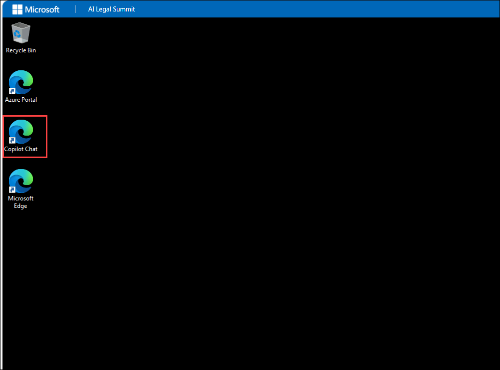
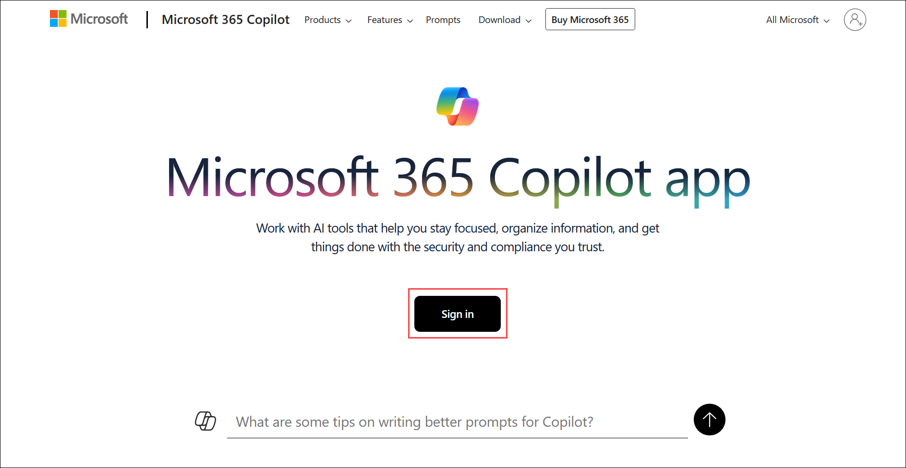
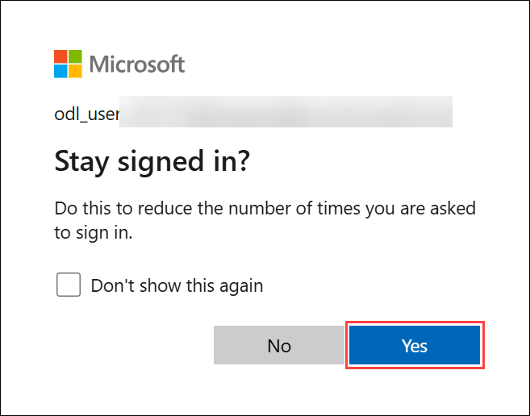
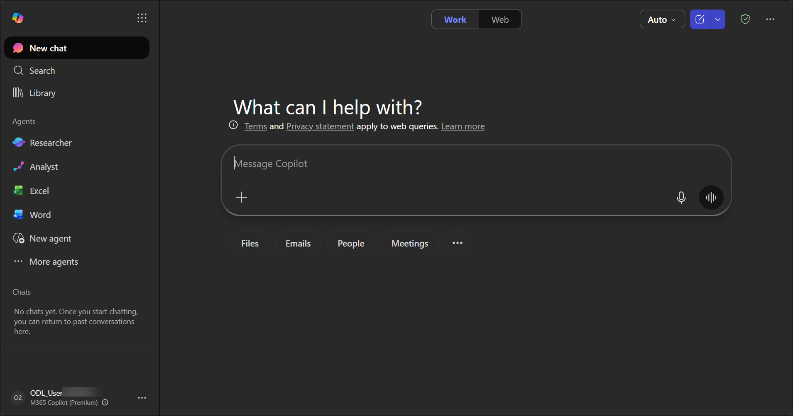
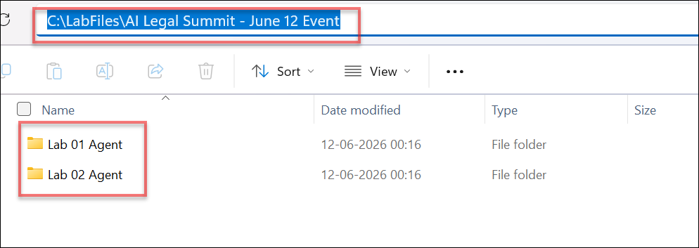

## 🚀 Getting Started with the Lab

We've prepared a seamless environment for you to explore and learn about Azure services. Let's begin by making the most of this experience:

## Accessing Your Lab Environment

Once you're ready to dive in, your virtual machine and **Guide** will be right at your fingertips within your web browser.

   

## Virtual Machine & Lab Guide

Your virtual machine is your workhorse throughout the workshop. The lab guide is your roadmap to success.

## Exploring your Lab Resources

To get the lab environment details, you can select the **Environment** tab. Additionally, the credentials will also be emailed to your registered email address.

   

## Utilizing the Split Window Feature

Utilizing the Split Window Feature: For convenience, you can open the lab guide in a separate window by selecting the **Split Window** button from the top right corner.

   

## Managing Your Virtual Machine
 
Feel free to **Start, Stop, or Restart (2)** your virtual machine as needed from the **Resources (1)** tab. Your experience is in your hands!

   

## Lab Guide Zoom In/Zoom Out Options

To adjust the zoom level for the environment page, click the A↕ : 100% icon located next to the timer in the lab environment.

   
  
## Let's Get Started with M365 Portal

1. On your virtual machine, click on the **Copilot Chat** icon.

    

1. In the M365 portal, click on **Sign in** button.

   

2. You'll see the **Sign into Microsoft** tab. Here, enter your credentials:

   - **Email/Username:** <inject key="AzureAdUserEmail"></inject>

     

3. Next, provide your Temporary Access Pass:

   - **Temporary Access Pass:** <inject key="AzureAdUserPassword"></inject>

     

1. If prompted to stay signed in, you can click **Yes**.

   

1. You will be redirected to the Microsoft 365 portal home page, as shown below:

   

## 📁 Lab Artifacts

The lab artifacts required to complete the hands-on exercises have been preloaded on the Jump VM and can be accessed at:

`C:\LabFiles\AI Legal Summit - June 12 Event`

This directory contains all required files and resources for:

- **Lab 01 Agent**
- **Lab 02 Agent**

## 📞 Support Contact

The **CloudLabs support** team is available 24/7, 365 days a year, via email and live chat to ensure seamless assistance at any time. We offer dedicated support channels tailored specifically for both learners and instructors, ensuring that all your needs are promptly and efficiently addressed.

Learner Support Contacts:

- Email Support: [cloudlabs-support@spektrasystems.com](mailto:cloudlabs-support@spektrasystems.com)
- Live Chat Support: https://cloudlabs.ai/labs-support
